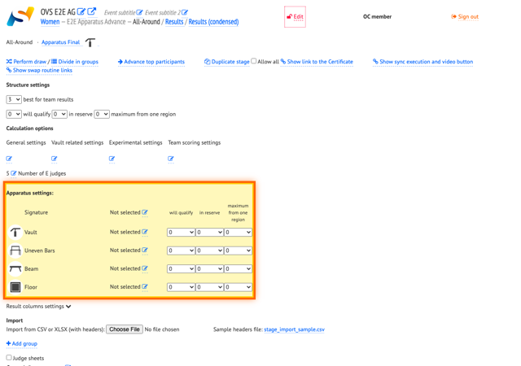
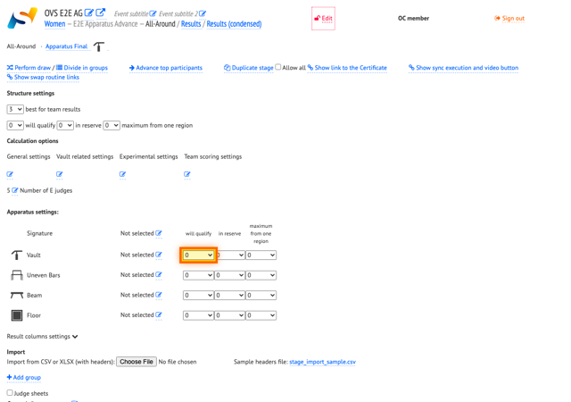
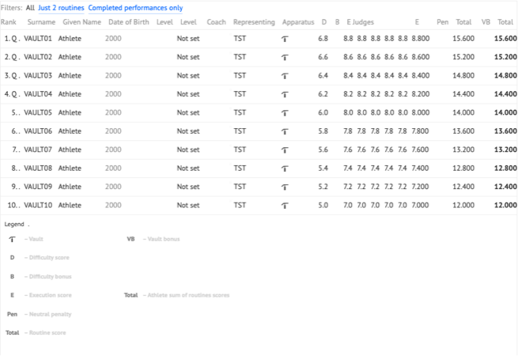
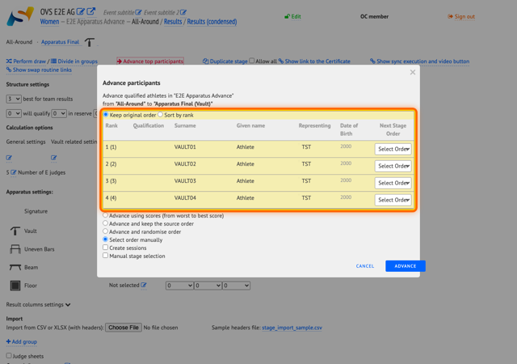

# Per-apparatus qualification and advance to apparatus final (AG)

Set how many gymnasts qualify on each apparatus during qualification, then advance only apparatus-qualified participants to the matching apparatus final. This walkthrough uses Vault on a WAG qualification stage.

## Prerequisites

- Log in to OVS as OC with permission to edit stages.
- A qualification stage where vault routine results are already published.
- A linked apparatus final stage (Vault final) configured for advance from qualification.

## Apparatus settings overview

On the stage **control** page, the **Apparatus settings:** table lists each routine on the stage. Each row shows the apparatus icon, judges panel assignment, and three limits per apparatus:

- **will qualify**
- **in reserve**
- **maximum from one region**

Per-apparatus limits apply only to that routine's ranking. Stage-wide all-around qualification limits, if configured elsewhere on the stage, are separate.

## Step-by-step

### 1. Open the qualification stage

Log in and open the qualification stage control page. Enable edit mode so stage settings can be changed.

### 2. Locate apparatus settings

Scroll to **Apparatus settings:** on the stage control page. The table has one row per routine with three drop-downs per apparatus under the column headers **will qualify**, **in reserve**, and **maximum from one region**.

*Apparatus settings: per-routine qualification limits.*

### 3. Set the vault will qualify limit

In the Vault row, set **will qualify** to the number of gymnasts that should qualify on vault (4 in this example). OVS recalculates Q marks for that routine only; other apparatus rows keep their own limits.

*Vault row — set **will qualify** before changing the value.*

### 4. Confirm Q marks on results

Open vault routine results. The top gymnasts up to the **will qualify** limit show a Q mark; gymnasts below that rank do not.

*Vault results — Q marks on qualified places.*

### 5. Open the advance dialog

Return to the qualification stage control page and click **Advance qualified participants**. The **Advance participants** dialog lists exactly the vault-qualified gymnasts. There is no count field — review the list, then confirm.

*Advance participants — fixed list of vault-qualified gymnasts.*

### 6. Confirm advance

Click **Advance** in the dialog. OVS moves the listed gymnasts to the Vault final stage.

### 7. Verify the vault final

Open the Vault final stage and confirm only the qualified gymnasts appear in the start list.

## Per-apparatus qualification limits

| Limit | Label (UI) | Behavior |
|-------|------------|----------|
| Qualification limit | **will qualify** | Top N gymnasts on that apparatus receive Q |
| Reserve count | **in reserve** | Additional R places marked as reserve on that apparatus |
| Max per region | **maximum from one region** | Cap how many from the same federation can qualify on that apparatus |

These limits apply per routine row in **Apparatus settings:**, independent of stage-wide all-around qualification if configured elsewhere.
