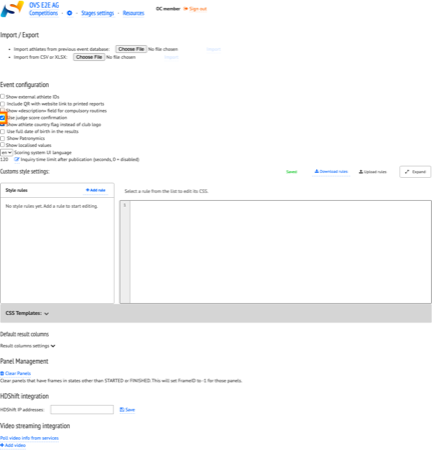
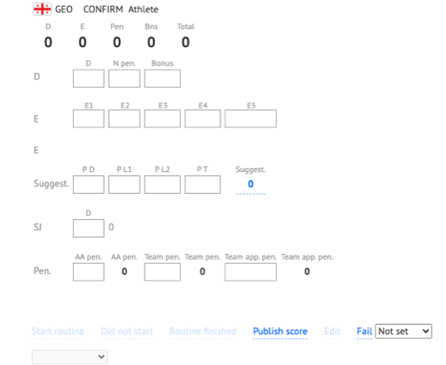
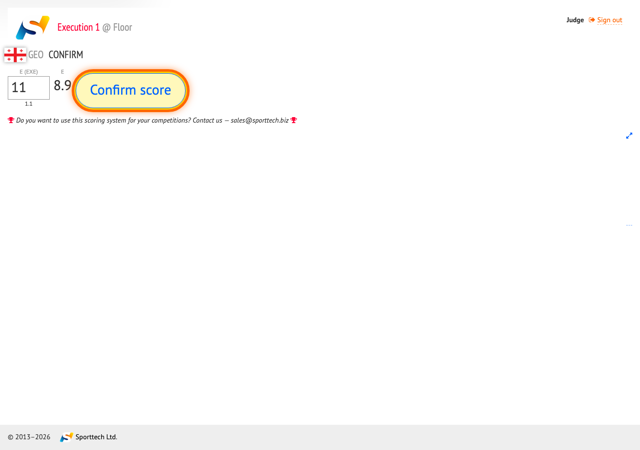
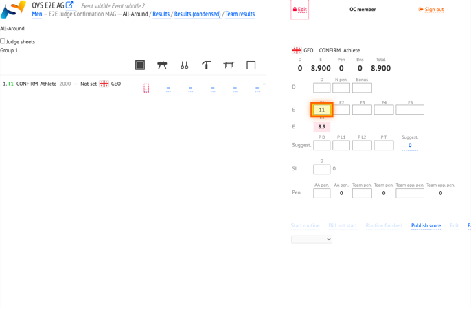
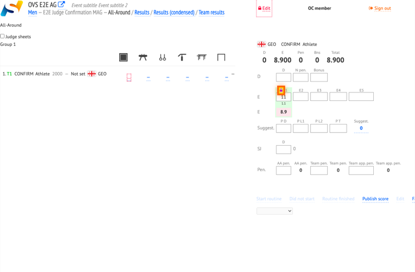

# Judge score confirmation (AG)

When **Use judge score confirmation** is enabled for an event, each judge must confirm marks on the judge tablet before they are locked. Until confirmation, the OC sees live values on the stage control page without a lock. After confirmation, the judge input is hidden and the OC column shows a lock control; OC can **Reset confirmation** to let the judge edit and confirm again.

## Prerequisites

- Log in to OVS as OC with permission to edit event settings and run routines.
- Enable **Use judge score confirmation** in event settings (see step 2).
- On the stage control page, select a routine, start it, and finish it so judges can enter marks.
- Open the judge tablet for the target panel and judge role (E1 in this walkthrough).

## Workflow overview

OC enables the setting and runs a routine. The judge enters a mark (for example an E deduction). The OC sees the value without a lock. The judge taps **Confirm score** and accepts the dialog. The OC then sees the locked column and may reset confirmation if the judge must change the mark.

## Step-by-step

### 1. Log in as OC

Log in to OVS with your OC credentials before changing event settings or running routines.

### 2. Enable judge score confirmation

Open **Settings** and go to **Event configuration**. Enable **Use judge score confirmation**. This applies to all apparatus panels for the event.

*Enable **Use judge score confirmation** in event settings.*

### 3. Open the stage and run a routine

Open the competition stage (for example MAG), select a routine from the start list, start it, and finish it. Judges can enter marks after the routine is finished.

*Select a routine, start it, and finish it on the stage control page.*

### 4. Log in as E1 judge

On the judge tablet, log in as E1 for the panel that covers this routine. The E deductions input becomes editable after the routine is finished.

### 5. Enter the E deduction on the judge tablet

Enter the mark in the E deductions field. When the value is saved but not yet confirmed, **Confirm score** appears below the inputs.

*Enter the mark; **Confirm score** appears when the value is saved but not confirmed.*

### 6. Check the score on the OC page (pending)

On the stage control page, the E1 column shows the judge’s value. There is no lock icon in the **Confirmations** row until the judge confirms.

*The E1 value is visible on OC; no lock until the judge confirms.*

### 7. Confirm the score on the judge tablet

Tap **Confirm score**. In the dialog, confirm that your marks are final (**Confirm that your marks are final?**). After confirmation, the E input is hidden on the judge tablet.

*Tap **Confirm score** and accept the confirmation dialog.*

### 8. Check the confirmed column on the OC page

The E1 column shows the lock/unlock control. OC can use **Reset confirmation** if the judge must edit the mark again.

*Confirmed E1 column with lock control on OC.*

### 9. Reset confirmation on the OC page

Click the unlock control in the E1 column. The judge can enter and confirm marks again.

*Click the unlock control in the E1 column to reset confirmation.*

## When to use judge confirmation

Enable **Use judge score confirmation** when organisers want judges to explicitly confirm final marks before OC treats them as locked. The setting applies to all apparatus panels for the event.

## Confirmed vs pending marks

| State | OC stage control | Judge tablet |
|-------|------------------|--------------|
| **Pending** | Judge value visible; no lock in the **Confirmations** row | Mark editable; **Confirm score** available |
| **Confirmed** | Lock/unlock control visible; **Reset confirmation** on hover | Mark input hidden after confirmation |
| **After reset** | Lock removed; value may still show | Judge can edit and confirm again |
