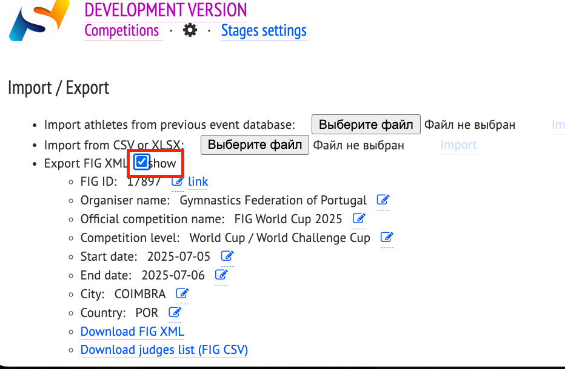
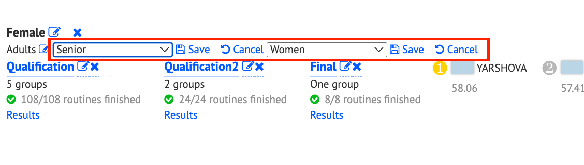
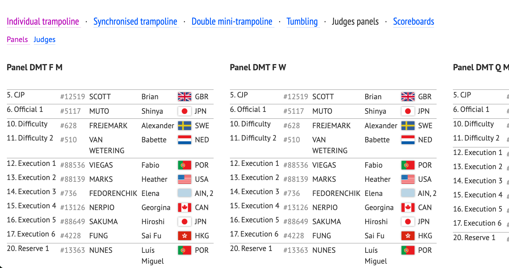
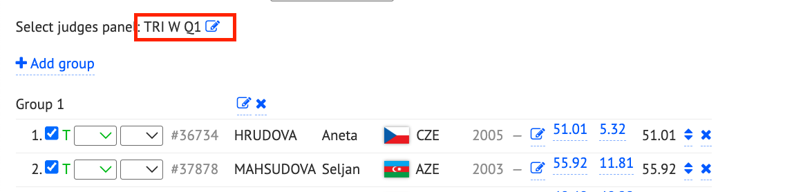
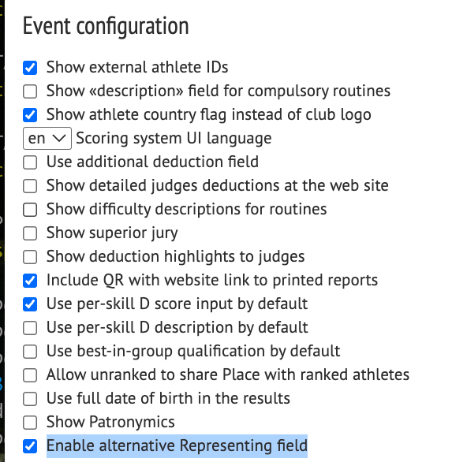
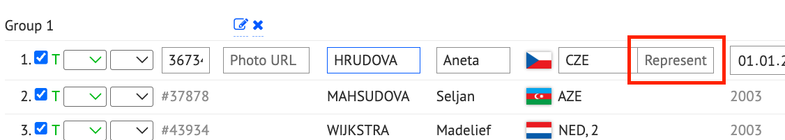
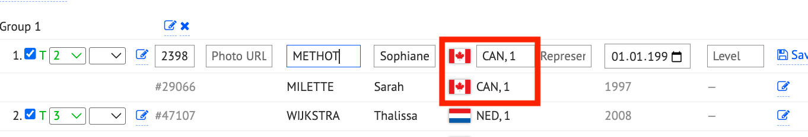
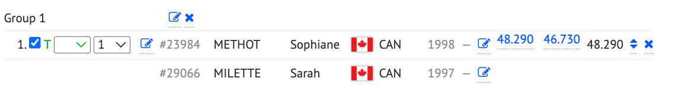

# FIG XML export

Some competitions require data to be submitted in the FIG XML format. We are actively working to support this format. To prepare your data for FIG XML export, follow these steps.

## 1. Enter FIG event details in Event Settings

Make sure to enter the correct FIG ID for the event. You should also copy all relevant information (such as competition name, level, dates, and location) from the official FIG website. Incorrect or missing data may cause the exported XML to fail FIG validation.

*Enter FIG event details on the Event Settings page.*

## 2. Set the age group and gender for each competition

For every competition section (for example Qualification or Final), specify the correct age group (for example Senior or Junior) and gender (for example Women or Men). This information is required for a valid FIG XML export.

*Set age group and gender for each competition section.*

## 3. Add judge panels and assign them to each stage

First, go to the **Judges** section on the main event page to create the necessary judge panels.

*Create judge panels in the Judges section.*

Then, on each **Stage** page, assign the appropriate judge panel to the corresponding competition stage. This ensures that judge data is correctly included in the FIG XML export.

**Note:** If a **Superior Jury (SJ)** member did **not** enter scores, assign them the **Official** role instead of a scoring judge role within the panel. This ensures correct role representation in the FIG XML export.

*Assign Official when an SJ member does not enter scores.*

## 4. Handle special representation types (for example AIN)

If your event includes participants competing under special representation types (such as **AIN**), go to **Event Settings** and enable **Enable alternative Representing field.**

*Enable the alternative Representing field in Event Settings.*

Then enter the appropriate **National Federation (NF) code** from the official FIG database into the **second Representation field** for those athletes.

*Enter the FIG NF code in the second Representation field.*

## 5. Set group numbers for group competitions

For events with group routines (for example **Synchronized Trampoline (SYN)** or **group routines in Rhythmic Gymnastics (RG)**), assign group numbers (for example **CHN1**, **CHN2**) to distinguish multiple groups from the same country.

There are two ways to set the group number:

- **Option 1:** Add it as a comma-separated value in the **Representing** field (for example `CHN, 1` for China Group 1).

*Representing field with country and group number.*

- **Option 2:** Use the **NumberInTeam** field, but leave the **Team number** unset.

*NumberInTeam used for the group number.*

## 6. Mark which gymnasts are on the floor (RG groups)

FIG XML requires exactly **five** gymnasts in `GroupMembers` for each RG group exercise — the gymnasts **on the floor**, not the full nominated roster (up to six).

To export the correct five:

1. In **Event Settings**, enable **Use In/Out statuses for groups**.
2. On the group stage, for each exercise, set **Compete** for the five gymnasts who perform and **Reserve** (or any status other than Compete) for the spare gymnast.
3. Download FIG XML only after statuses are set for the routines you export.

With this setting enabled, FIG XML includes only gymnasts marked **Compete**. If all six remain without In/Out filtering, FIG validation can fail with *Unexpected number of gymnast, 5 gymnasts are required*.

## 7. Download the FIG XML and submit it for validation

Once all data is prepared, download the **FIG XML** file from the **Event Settings** page and upload it to the **FIG JEP** platform for validation.

### Common issues to check

- **Judge and athlete names** may need to match the FIG database exactly. Differences between your scoring system and FIG records can cause validation errors.
- **Format updates** in the FIG XML specification may also lead to issues.
- For **RG groups**, confirm that each exported exercise lists exactly five **Compete** gymnasts (see step 6).

If you encounter problems during validation, contact us — we can help resolve them.

---

Source help article: [FIG XML export (Freshdesk)](https://sporttechbiz.freshdesk.com/support/solutions/articles/4000219340-fig-xml-export).
