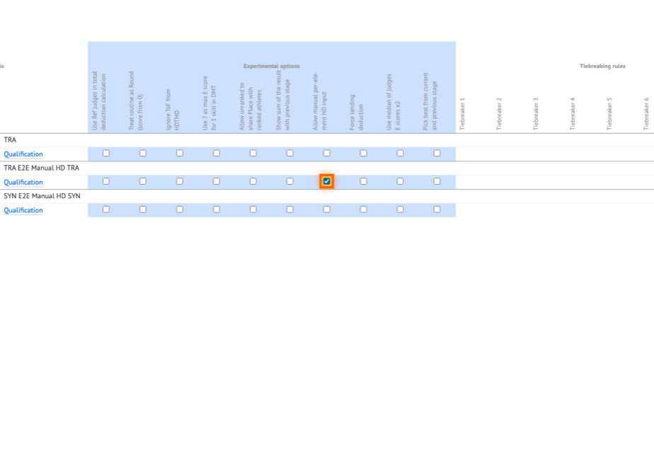
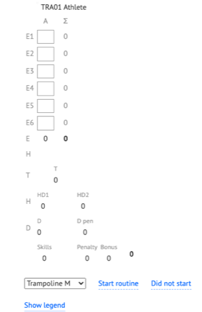
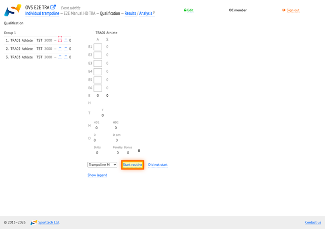
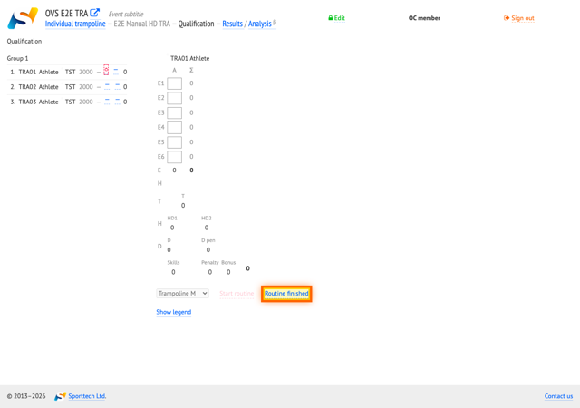
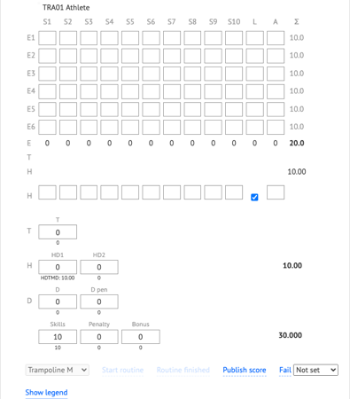
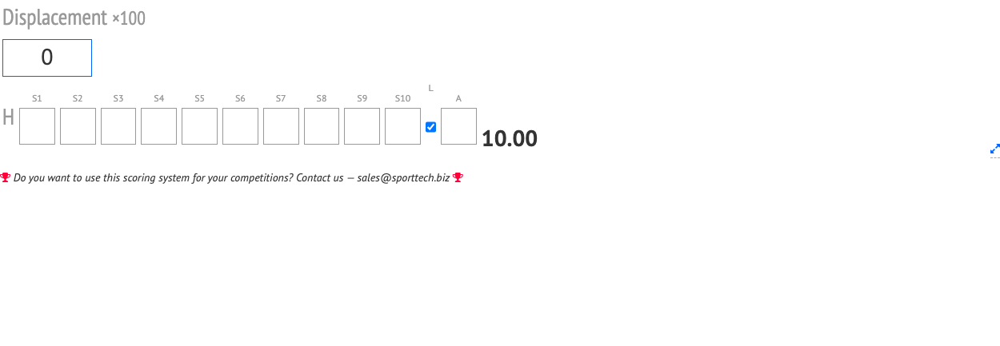
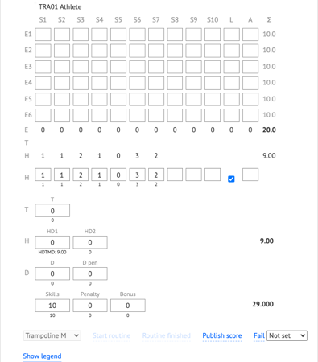
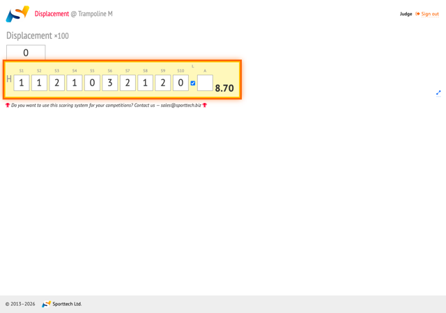

# Manual per-element HD input on the displacement judge tablet

This guide explains how to enter horizontal displacement (HD) deductions element by element on the **Displacement** judge tablet (H1) at TRA and synchronised trampoline (SYN) events. When the stage is configured with **Allow manual per-element HD input**, the judge enters values for skills S1 through S10 plus landing **L** on the tablet; the system calculates the routine's displacement total and shows a preview on H1. The OC still starts and finishes each routine from the control page.

## Prerequisites

- The stage has **Allow manual per-element HD input** enabled (see step 2 and [When manual HD entry is available](#when-manual-hd-entry-is-available) below).
- OC is logged in on the control computer and has opened the correct stage and routine.
- The displacement judge (H1) is logged in on panel 0 on a separate tablet or browser window.
- Use the event URL and passwords provided by the competition OC.

## Workflow overview

1. OC enables **Allow manual per-element HD input** for the stage in **Settings → Stages**.
2. OC selects the routine and starts it.
3. When the routine ends, OC finishes it on the control page. Landing **L** is set automatically on the OC side after finish.
4. H1 sees the manual **H** row(s) on the judge tablet with landing **L** already checked; the judge enters per-element deductions (0–3) for each skill.
5. For SYN, both athletes' rows are entered on the same H1 tablet (see [Synchronised trampoline (SYN)](#synchronised-trampoline-syn)).
6. The total displacement preview on H1 updates as values are entered, provided the **Displacement** override field above the row is left at zero.

## Step-by-step

### 1. Log in as OC

Log in to OVS with the OC role on the control computer. No screenshot for this step — the login screen is the standard OVS sign-in form.

### 2. Enable manual HD stage option

Open **Settings → Stages**. In the **Experimental options** column, enable **Allow manual per-element HD input** for the TRA or SYN stage you are running. The checkbox is highlighted in the figure below.

*Figure: Stage settings — **Allow manual per-element HD input** checked for the target stage.*

### 3. Open the stage and select the routine (OC)

On the OC control page, open the TRA or SYN stage for the competition and select the first routine (or the routine currently being judged) in the start list. The frame inputs panel shows the selected athlete or pair.

*Figure: OC frame inputs after opening the stage and selecting a routine.*

### 4. Log in as displacement judge H1

On a separate device, log in to OVS as judge **H1** (**Displacement**) for panel 0. The judge page shows the judge role in the header. Manual **H** input rows appear only after the routine has been finished.

No screenshot for this step — the judge login screen is the standard OVS sign-in form.

### 5. Start the routine (OC)

From the OC frame inputs, start the selected routine. The **Start** control is highlighted in the figure below.

*Figure: OC **Start** control on frame inputs (before click).*

### 6. Finish the routine (OC)

When the athlete completes the routine, finish it from the OC frame inputs. After finish, landing **L** is set automatically on the OC manual **H** rows.

*Figure: OC **Finish** control on frame inputs (before click).*

### 7. Confirm landing and manual HD UI

Check that landing **L** is checked on both the OC manual **H** row and the judge tablet. On H1, the per-element **H** row (S1–S10 and **L**) should be visible below the **Displacement** override field.

*Figure: OC after finish — landing **L** checked on the manual **H** row.*

*Figure: H1 judge page after finish — manual **H** row visible, landing **L** checked.*

### 8. Enter manual HD values on judge H1

On the H1 tablet, enter a deduction value from **0** to **3** for each skill column S1–S10. Values are saved as you move between fields. The total displacement preview at the end of the row updates when per-element entry is used and the **Displacement** override (×100) above the row is zero.

For SYN, fill both **H** rows on the same H1 tablet — one row per athlete — before the total is complete.

*Figure: OC reflecting updated manual **H** data after judge entry.*

*Figure: H1 after entering per-element deductions — filled cells and total preview.*

## When manual HD entry is available

Manual per-element entry appears on H1 only when the stage option **Allow manual per-element HD input** is turned on for that stage. This applies to TRA and SYN disciplines.

When the option is **off**, H1 shows only the **Displacement** override field (×100), where the judge can enter a single total manually. When the option is **on**, H1 shows the override field **and** the manual **H** row(s) for S1–L.

OC configures the option on **Settings → Stages** in the **Experimental options** column (see step 2 above).

## Synchronised trampoline (SYN)

At SYN events with manual HD enabled, both athletes' horizontal displacement is entered on **one** H1 tablet:

- The first **H** row corresponds to athlete 1 (tra1).
- The second **H** row corresponds to athlete 2 (tra2).

Each row has its own S1–S10 columns and landing **L** checkbox. The displacement judge enters both rows on H1.

The second displacement judge tablet (H2) keeps only the **Displacement**2 override field for a manual total on athlete 2 when needed — it does not duplicate the per-element tra2 row.

## Landing and total preview

**Landing (L)** — After OC finishes the routine, landing **L** is set automatically on the OC manual **H** rows. The same state appears on the H1 tablet over the event connection. The judge can see and, if necessary, change **L** on the tablet; OC and H1 stay in sync.

**Total preview** — The figure at the right end of the manual **H** row on H1 shows the calculated displacement total (the same value as on the OC frame inputs when per-element data drives the score). It updates when:

- Per-element deductions are entered in S1–S10,
- Landing **L** is set, and
- The **Displacement** override field on H1 is **zero** (no manual total override).

If the judge enters a non-zero value in the **Displacement** override field, that manual total takes precedence and the system ignores the per-element calculation until the override is cleared.
