# Scoreboard Director + Manual scoreboard scenario overview

Guide for scoreboard operators who want finer control over what appears on the display than standard Panel coverage. When a scoreboard runs the **Manual** scenario, the **Scoreboard Director** chooses what to send to the display: group start lists, routine and stage results, team standings, and more.

## Prerequisites

1. Log in as **Scoreboard** (password configured for the scoreboard role — use credentials provided by the competition OC).
2. Open the scoreboard **display** in one browser window: `/scoreboards/0` (or the scoreboard number you control).
3. Use a second window for **control** — routine, group, and stage pages where the director bar and action controls appear.
4. On the **Scoreboards** page (`/scoreboards/`), confirm the **Manual** scenario is selected for the target scoreboard (see step 2).

## Director bar overview

Control pages (routine, group, stage — not `/scoreboards/`) have **two separate UI layers** for the scoreboard director.

### Scoreboard director bar

A fixed bar sits **above** the page content on control pages. It manages scoreboards and how commands are applied:

- **Display mode** — drop-down in the bar header (**Show**, **Enqueue**, **Clear and show**); applies to action buttons on the page unless a command specifies otherwise (see [Display modes](#display-modes)).
- **Scoreboard list** — choose which scoreboards you manage.
- **Collapse** / **Expand** — hide or show bar details.
- Per managed scoreboard card:
  - **Settings** tab — scoreboard **scenario**, **Queue rotation**, minimum screen timings, **Auto** checkboxes for intro/results/standings, and more settings.
  - **Queue** tab (Manual scenario) — current screen, queued items, **Clear display**.

The director bar does **not** include **Show intro**, **Show results**, **Show standings**, or **Show group start list** buttons.

Each scoreboard maintains a **queue** of screens; each queued screen has a minimum display time.

### Action controls on the page

Show/hide commands are sent from **context blocks** embedded in the page you are working on:

| Page | Block | Actions |
|------|-------|---------|
| Routine page (judge OC) | **Scoreboard control** | **Show intro**, **Show results**, **Show standings** |
| Stage groups | **Scoreboard** (per group) | **Show group start list** |
| Stage / stage results | **Scoreboard** | **Show results**, **Show team results** |

Set **Display mode** in the director bar, then click the action on the relevant page block.

Keep the display window open on `/scoreboards/N` while you operate the control window.

---

## Step-by-step

### 1. Open the scoreboard display

Log in as scoreboard and open `/scoreboards/0`. The scoreboard block should be visible; initially the display is empty. Leave this window open while you work in the control window.

*Figure: Scoreboard display window at `/scoreboards/0` — empty before any director action.*

### 2. Open the Scoreboards configuration page

In the control window, go to `/scoreboards/`. Confirm the **Manual** scenario is selected for the scoreboard you will drive.

The scoreboard **scenario** is set on this page. **Manual** is the usual choice for director work; you can also change the scenario from the director bar on control pages, but verify it here before you start.

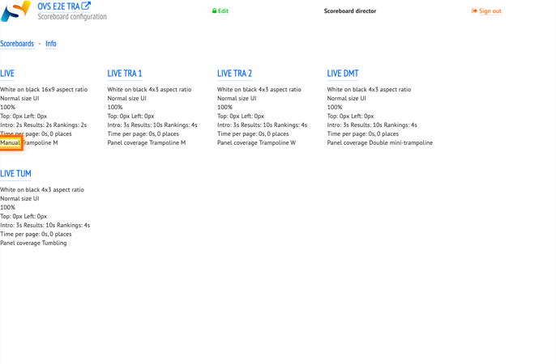

*Figure: **Scoreboards** page — the **Manual** scenario is highlighted on the LIVE scoreboard card.*

### 3. Open TRA routine director controls

Navigate to the TRA competition stage and open a routine. The **Scoreboard control** block on the routine page sends intro, results, and standings to the display.

Set **Display mode** in the director bar to **Clear and show** before the routine actions in the following steps.

The **Display mode** drop-down (highlighted in the screenshot) selects how each action affects the queue:

- **Show** — adds the screen to the **start** of the queue.
- **Clear and show** — clears the queue and shows the screen **immediately**.
- **Enqueue** — adds the screen to the **end** of the queue.

See [Display modes](#display-modes) for full definitions using the UI labels.

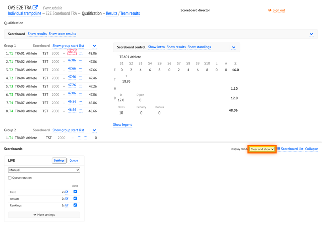

*Figure: Routine page — **Display mode** in the director bar (highlighted) set to **Clear and show**; **Scoreboard control** action block on the page.*

### 4. Show routine intro

Click **Show intro** in **Scoreboard control**. The display switches to the routine intro screen.

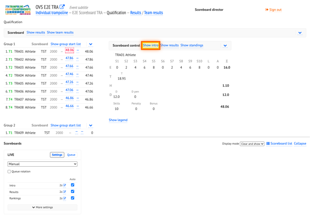

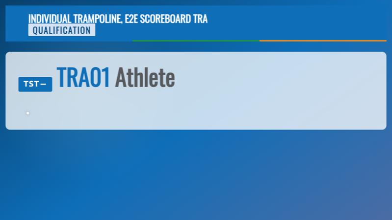

*Figure: Control window with **Show intro** highlighted (top) and routine intro on the scoreboard display (bottom).*

### 5. Show routine scores

Click **Show results**. The display shows the athlete scores for the current routine.

The scoreboard director can send scores to the display **on demand**. This is especially useful when working with TV: the broadcaster can receive scores on the scoreboard before they appear on the kiss-and-cry screen.

The director bar **Settings** also control automatic intro, score, and ranking screens. When enabled, those screens are added to the queue as in Panel coverage. In the Manual scenario the director can disable that for finer control.

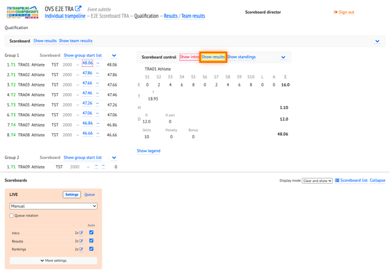

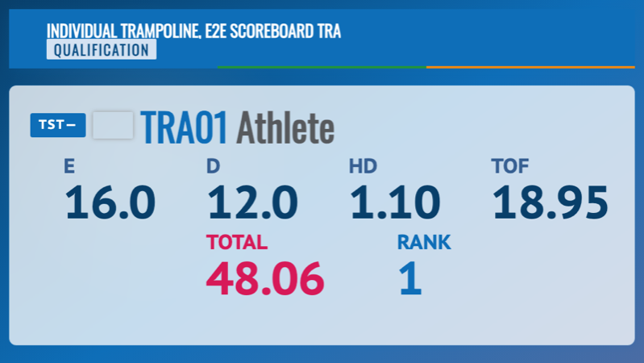

*Figure: **Show results** highlighted on the routine page (top) and athlete scores on the display (bottom).*

### 6. Show routine standings

Click **Show standings**. The display shows rankings for the current routine (e.g. athlete **TRA01** at the top).

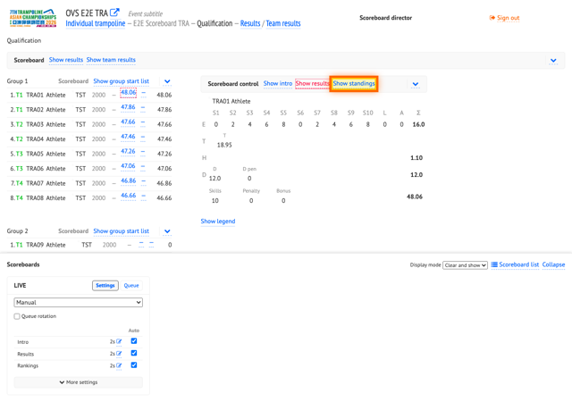

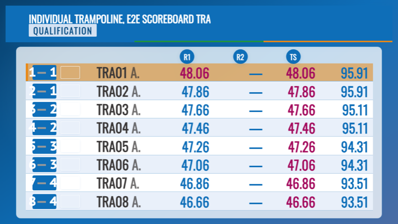

*Figure: **Show standings** highlighted on the routine page (top) and routine standings on the display (bottom).*

### 7. Show TRA group 2 start list

On the group page, use **Show group start list** for group 2. The display shows the start list (e.g. bib **TRA09**).

In the Manual scenario, **Show group start list** lets the director push an upcoming group start list to the apparatus display or to the main LED scoreboard — useful when you want the audience to see who is up next before the group begins.

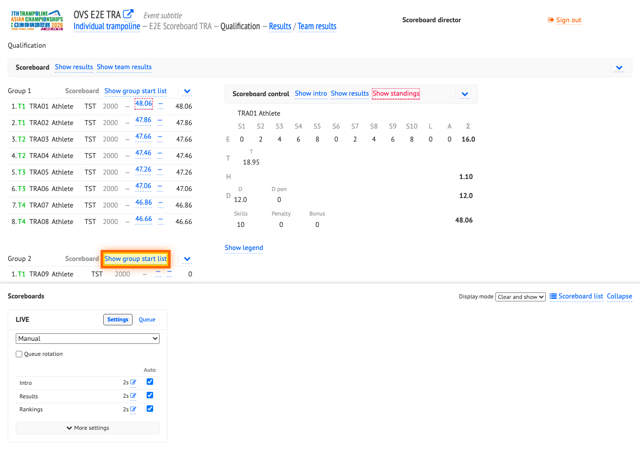

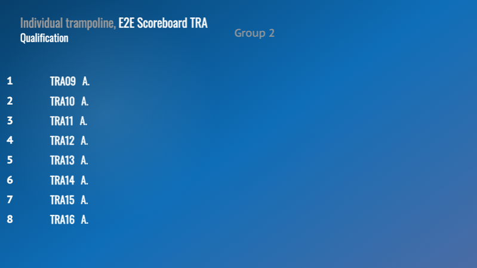

*Figure: **Show group start list** for group 2 highlighted on the TRA group page (top) and the start list on the display (bottom).*

### 8. Show SYN group 2 start list

Switch to the SYN discipline and open the SYN competition stage using the standard OVS navigation (discipline selector and stage list). On the group page, click **Show group start list** for group 2 (e.g. bib **SYN09**).

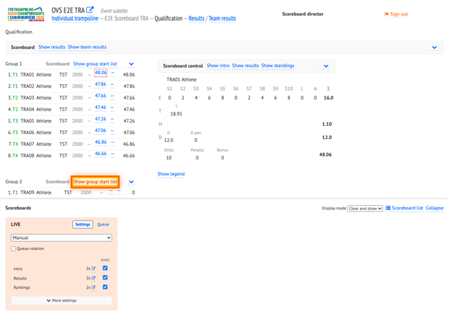

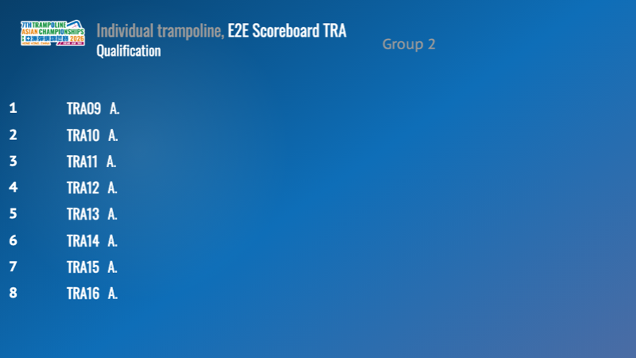

*Figure: **Show group start list** for SYN group 2 highlighted on the control page (top) and the SYN start list on the display (bottom).*

### 9. Enable queue rotation and enqueue start lists

1. Expand the director bar (**Expand** / **More settings** if collapsed).
2. Enable **Queue rotation**.
3. Set **Display mode** to **Enqueue**.
4. Open the **Queue** tab and clear the queue if needed.
5. On TRA stage — open group 2 and click **Show group start list** (adds to queue).
6. On SYN stage — open group 2 and click **Show group start list** (adds to queue).

Queued screens rotate on the display according to each screen's minimum duration. This is useful to show results or start lists during breaks between competitions.

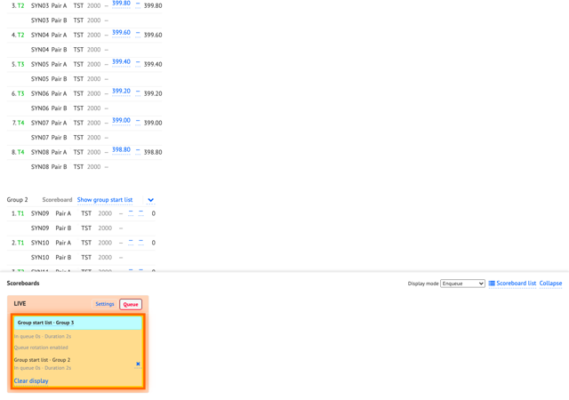

*Figure: Director bar with **Display mode** set to **Enqueue**, **Queue** tab open, and TRA/SYN group start lists in the queue (highlighted).*

### 10. Queue rotation on the display

With **Queue rotation** enabled, the scoreboard automatically alternates between queued screens (TRA group 2 start list → SYN group 2 start list → TRA → SYN, every few seconds according to scoreboard timing).

*Figure: Display showing one of the rotating group start lists. The scoreboard cycles through TRA and SYN automatically.*

### 11. Clear queue and open stage results

1. Clear the display queue (**Queue** tab).
2. Set **Display mode** back to **Clear and show**.
3. Open the TRA stage **Results** page (stage results view from the header).

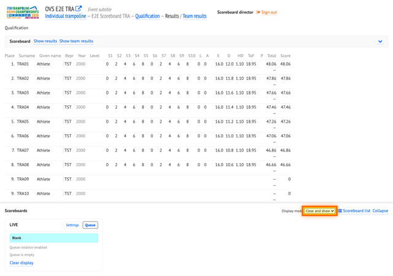

*Figure: TRA stage **Qualification** results page — **Display mode** (highlighted) set back to **Clear and show**; **Scoreboard** block for stage actions on the page.*

### 12. Show stage results

On the stage results page, click **Show results** in the **Scoreboard** block. The display shows stage-level results (e.g. **TRA01**).

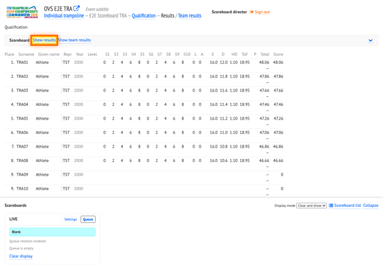

*Figure: **Show results** highlighted on the stage results page (top) and stage results on the display (bottom).*

### 13. Show stage team results

Click **Show team results** in the **Scoreboard** block. The display shows team standings (e.g. team code **TST**).

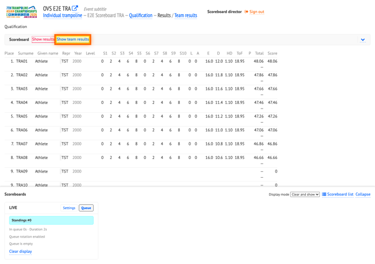

*Figure: **Show team results** highlighted on the stage results page (top) and team standings on the display (bottom).*

---

## Display modes

| Mode | Label (UI) | Behavior |
|------|------------|----------|
| Show | **Show** | Add the screen to the start of the queue and show it. |
| Enqueue | **Enqueue** | Add the screen to the end of the queue; with **Queue rotation**, the display cycles through queued items. |
| Clear and show | **Clear and show** | Clear the queue and show the selected screen immediately. |

**Display mode** is the drop-down in the director bar header. Choose it before clicking action buttons in the page blocks (**Show intro**, **Show results**, **Show group start list**, etc.).

### Queue rotation

When **Queue rotation** is enabled (under **Settings**), the scoreboard automatically advances through items in the **Queue** tab. Set **Display mode** to **Enqueue** to build the rotation list, then verify the display cycles as expected.

After each screen has been shown for its minimum time, it moves from the front of the queue to the **end**. That creates a loop: the same screens repeat in order until you **Clear display** (empty the queue) or turn off **Queue rotation**.
